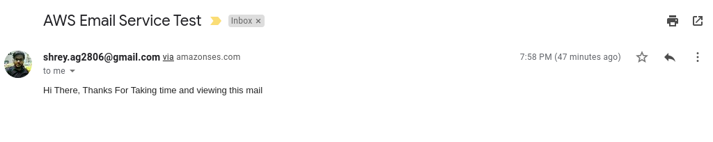

# AWSEmailExample

## Application
To consume AWS Simple Email Service (SES) to send Email rather than through ISP Email Server.

## How to run the Code

1. You have to create and AWS account.
2. Then you have to create an **IAM User** with permissions set ( **AmazonSESFullAccess**).
3. This will generate **access key ID** and **secret access key** for your use.
4. As this SES service is for trial you have to verify email account of both sender and receiver in AWS Management Console.

Create a shared crediantial file in local system or development environment.

1.) In a text editor, create a new file. In the file, paste the following code:
```
[default]
aws_access_key_id = YOUR_AWS_ACCESS_KEY_ID
aws_secret_access_key = YOUR_AWS_SECRET_ACCESS_KEY
```

2.) In the text file you just created, replace YOUR_AWS_ACCESS_KEY with your unique AWS access key ID, and replace YOUR_AWS_SECRET_ACCESS_KEY with your unique AWS secret access key.

3.) Save the file with name **credentials**.
Directory Structure.
```
Linux/MAC : ~/.aws/credentials
Windows : C:\Users\<yourUserName>\.aws\credentials
```

After above setup is done. Replace the **FROM** , **TO** , **BODY** , **SUBJECT** in **EmailUtil.java** file with your own.

After you run the application the email at recipient end would look like :



